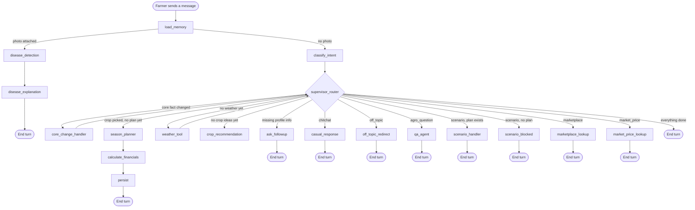

# The Conversation Agent, Explained Simply

This document walks through **everything** the conversation agent does — every node, every decision, every piece of memory — in plain words, from the moment a farmer sends their very first message to the moment a full season plan is saved. It describes the code as it actually works today (not the original pitch/spec — see `AgriSense_AI_Architecture.md` for that earlier planning document).

There are two separate agents in this project:

- **The conversation agent** (this document) — runs once per chat message, while the farmer is actively talking.
- **The monitor agent** — runs on its own schedule in the background, watching the weather and adjusting an already-committed plan. It is a different graph (`graph_monitor.py`) and is only mentioned here where the two connect.

---

## 1. The big picture, in one paragraph

The conversation agent is a **LangGraph graph** — think of it as a flowchart of steps ("nodes") connected by arrows ("edges"), where a little bit of code runs at each step. Every time the farmer sends a message, the *whole graph* runs once, starting at a fixed entry point and ending wherever that particular message's needs lead it — sometimes that's a single step (a quick reply), sometimes it's a whole chain of steps (onboarding → weather → crop ideas → season plan → cost breakdown, all in one go). A **router** sits between certain nodes and decides which node runs next, based on what the farmer said and what already exists for this farm.

---

## 2. Two kinds of memory (important to understand first)

The agent has **two separate places** it remembers things, and mixing them up is the source of most subtle bugs, so it's worth being precise:

1. **The LangGraph checkpoint** — a scratchpad for *this specific conversation thread*, keyed by the farmer's user ID. It holds the message history, the in-progress farm profile, the trace log, and more. It's what `load_memory` reads at the start of every turn and what `persist` (indirectly) keeps in sync.
2. **The Postgres domain tables** (`Farm` and `Plan`) — the durable, "real" record of the farm. This is what survives forever, what the dashboard reads on a page reload, and — critically — **what the monitor agent writes to directly** when it adjusts a plan because of incoming weather. The conversation graph does not automatically see a monitor-agent change until `load_memory` re-reads these tables on the next turn.

Every turn starts by re-syncing from Postgres (via `load_memory`), specifically *because* the monitor agent might have changed something since the farmer's last message. This is also why a mid-replan window (see §7) has to temporarily suspend that re-sync — otherwise a not-yet-saved fresh plan would get overwritten by the still-old one sitting in Postgres.

---

## 3. The whole graph, at a glance

A few things worth noticing in that diagram:

- **`load_memory` always runs first.** No exceptions.
- **A photo attached to the message skips everything else** and goes straight to disease detection — this check happens before intent classification even runs, because a leaf photo is unambiguous.
- **`weather_tool` and `core_change_handler` loop back into the router** instead of ending the turn — they're "continue" nodes, not "stop" nodes, so one farmer message can chain through several steps automatically (see the walkthrough below).
- Everything else is a dead end for that turn: it produces a reply and the turn is over, waiting for the farmer's next message.

---

## 4. A brand-new farmer's first conversation, step by step

This is the story of the most common path through the graph: onboarding.

1. **Farmer**: *"Hi, I want to plan my season."*
   - `load_memory` looks for a `Farm` row for this user. There isn't one yet, so it returns nothing — the state stays empty.
   - `classify_intent` reads the message. No profile facts to extract, so it classifies this as `slot_fill` (the fallback/default intent for "talking about their farm").
   - The router sees `missing_fields` is basically everything → routes to **`ask_followup`**, which asks the first missing thing in a fixed order: location, acres, soil type, water availability, budget, season. It asks *one* question at a time. Turn ends.

2. **Farmer**: *"Rajshahi"* → `classify_intent` reads the *previous AI message* ("where's your farm located?") to understand that this bare word answers that specific question, and extracts `location: "Rajshahi"`. Still missing everything else → `ask_followup` asks for acres next. Turn ends.

3. This repeats for acres, soil type, water availability, budget, and season — one question, one answer, one turn each. (A farmer can also just say all of it in one long message — `classify_intent` pulls out whatever fields are actually present, regardless of how many.)

4. **Farmer answers the last missing field** (say, season). Now `missing_fields` is empty. The router's slot-fill chain checks the next box: *is there weather data yet?* No → routes to **`weather_tool`**.
   - `weather_tool` geocodes the farm's location into latitude/longitude (only the first time — after that it's cached on the profile) and calls the real Open-Meteo weather API for a 14-day forecast.
   - Because `weather_tool` isn't a dead-end node, control goes back to the router *in the same turn*.

5. Router checks again: weather now exists, but there are still no crop candidates → routes to **`crop_recommendation`**.
   - This node builds a search query from the farm's soil + season, retrieves grounded agronomic material from the knowledge base (falling back to a real web search if the knowledge base has nothing relevant), and asks the LLM to rank at least 3 candidate crops using that material *and* the real weather numbers.
   - It also attaches live market data (current price, trend, a sell-now/store/wait verdict) to each candidate where available.
   - This node **is** a dead end — it shows the farmer the ranked list and asks "which one would you like?" Turn ends.

6. **Farmer**: *"Let's go with Rice."* (Must match one of the shown candidate names.)
   - `classify_intent` recognizes this as selecting a shown candidate and sets `selected_crop`.
   - Router: weather exists, crop candidates exist, a crop is now selected, no plan yet → routes to **`season_planner`**.
   - `season_planner` retrieves crop-specific fertilizer/irrigation/pest reference material, feeds it plus the real forecast into the LLM, and gets back a full dated calendar (sowing window, fertilizer schedule, irrigation schedule, pest/disease risk windows, weed checkpoints, harvest window) — all as day-offsets from today, which this node converts into real calendar dates.
   - This node is *not* a dead end on its own — it always flows straight into `calculate_financials`.

7. **`calculate_financials`** runs a pure, deterministic (no LLM) cost calculation: land prep, seeds, fertilizer, irrigation, pest control, labor, post-harvest — each priced from a real per-kg/per-acre rate table — plus expected revenue from the projected yield, giving cost, revenue, profit, ROI, and break-even. It always flows into `persist`.

8. **`persist`** saves everything — the farm profile, the selected crop, the season plan, the financials — into the real Postgres tables (creating the `Farm`/`Plan` rows the very first time). It writes a short human-readable summary message and ends the turn.

At this point the farmer has gone from a completely empty profile to a costed, weather-grounded, explained season plan — potentially across many short messages, but with no single message ever doing more work than "answer one question" until the final chain (weather → crops → plan → financials → save) runs automatically once enough is known.

---

## 5. Every node, explained one at a time

### Entry and understanding

**`load_memory`** (`nodes/load_memory.py`)
Runs first, every single turn. Reads the farm's profile and (unless a replan is mid-flight — see §7) the committed crop/plan/financials straight from Postgres, so the chat always reflects reality even if the monitor agent changed something between messages. Also takes a fresh snapshot of the profile *as committed* (`committed_farm_profile`) — this is the "before" picture that later gets compared against "after" to detect a real profile change.

**`classify_intent`** (`nodes/classify_intent.py`)
The traffic-sorting node. One LLM call decides:
- Which of 7 **intents** this message is (`slot_fill`, `scenario`, `agro_question`, `off_topic`, `chitchat`, `marketplace`, `market_price`).
- Whether any farm profile fields (location, acres, soil, water, budget, season) are mentioned — but this is **only ever applied** when the intent is `slot_fill`. This guard exists specifically so that a question like *"what's the temperature in Bogura?"* — clearly `agro_question`, just naming a place — can never quietly overwrite the farm's real, saved location.
- Whether a shown crop candidate was picked.
- Scenario numbers ("what if rainfall drops 30%"), marketplace details (what product, which district), or market-price details (which crop, sell now or wait).
- Whether a pending yes/no replan question was just answered.

### Onboarding

**`ask_followup`** (`nodes/ask_followup.py`)
Purely mechanical: looks at what's still missing, asks for the next one in a fixed order (location → acres → soil → water → budget → season). No LLM call. Always ends the turn.

**`weather_tool`** (`nodes/weather_tool.py`)
Geocodes the farm's location the first time (caching lat/lon onto the profile afterward) and calls the real Open-Meteo API for a 14-day forecast. Not a dead end — hands control back to the router.

**`crop_recommendation`** (`nodes/crop_recommendation.py`)
Retrieves grounded agronomic material for "suitable crops for [soil] soil in [season] season," falls back to a real web search if that comes up empty, and asks the LLM to propose at least 3 ranked candidates using that material plus the real weather. Attaches live market snapshots where available. Always ends the turn, waiting for the farmer to pick one.

**`season_planner`** (`nodes/season_planner.py`)
For the chosen crop, retrieves fertilizer/irrigation/pest-control reference material and asks the LLM for a full dated plan, grounded in that material and the real forecast. Converts the LLM's day-offsets into real calendar dates. Always flows into `calculate_financials`.

**`calculate_financials`** (`nodes/calculate_financials.py`)
A thin wrapper around a pure-math function (`tools/financials.py`) — no LLM, no guessing. Turns the season plan into an itemized cost breakdown and a profit/ROI/break-even projection. Always flows into `persist`.

**`persist`** (`nodes/persist.py`)
Writes the farm profile and (if this isn't a hypothetical scenario run) the committed plan + financials to Postgres. Builds a short natural-language summary of the plan as the reply. Always ends the turn.

### Everyday questions and actions

**`qa_agent`** (`nodes/qa_agent.py`)
For general questions that don't need to *change* anything. This is the one genuinely free-form node: instead of one fixed retrieval path, it hands the model four tools and lets it decide which to use:
- `farm_dashboard` — the farmer's own profile/crop/plan/financials, exactly as already computed.
- `knowledge_base` — the grounded agronomic reference material.
- `current_weather` — a live forecast, for the farm or any other named place.
- `web_search` — a last-resort real web search, only when the knowledge base has nothing relevant.
The system prompt is explicit that the model must never answer a checkable fact from memory — it has to call a tool and cite what came back. Every tool call is logged to the trace panel.

**`casual_response`** (`nodes/casual_response.py`)
Greetings and small talk. A lightweight, streamed LLM reply with no tools — nothing to ground, nothing to trace.

**`off_topic_redirect`** (`nodes/off_topic_redirect.py`)
A fixed, canned message steering the conversation back to farming. No LLM call.

**`marketplace_lookup`** (`nodes/marketplace_lookup.py`)
"Where can I buy urea near me?" — a structured (non-LLM) database search over a seeded supplier catalog, ranked by price/stock/delivery/rating, and by real distance when a location is available (an explicitly-named district first, then the farmer's current browser location, then the farm's own location, in that priority order).

**`market_price_lookup`** (`nodes/market_price_lookup.py`)
"Should I sell my rice now?" — pulls a real current-price snapshot plus 180-day history for the crop, and runs it through a deterministic decision engine (never an LLM guess) to produce a SELL NOW / STORE / WAIT verdict with reasons.

**`disease_detection`** + **`disease_explanation`** (`nodes/disease_detection.py`, `nodes/disease_explanation.py`)
Triggered instead of the normal path whenever the message carries an uploaded photo (checked before intent classification even runs). `disease_detection` calls a real image-classification API (crop.health) for the top-3 candidate diseases, then asks a second, independent vision model to look at the same photo and either confirm or disagree — a diagnosis is only called "high confidence" when both agree. `disease_explanation` then turns that into a farmer-facing message, always naming which source said what, and never inventing a diagnosis if either service failed.

### Special situations

**`core_change_handler`** (`nodes/core_change_handler.py`) — see §7 below, it's involved enough to deserve its own section.

**`scenario_handler`** and **`scenario_blocked`** — see §8 below.

---

## 6. The router's rulebook, in plain English

There are two router functions (`router.py`), both plain Python — no LLM involved in the routing decision itself, only in what each node does once chosen.

**`intake_router`** — runs once, right after `load_memory`:
> "Does this message have a photo attached? If yes, go straight to disease detection, no matter what text came with it. Otherwise, go classify the intent as normal."

**`supervisor_router`** — runs after `classify_intent`, and again after `weather_tool` or `core_change_handler` (since those two loop back instead of ending the turn). Its priority order:

1. **Is the turn already marked complete?** → stop.
2. **Was the farmer just asked a pending yes/no replan question?** → always goes to `core_change_handler`, regardless of what intent was classified — a bare "yes" could otherwise be misread as chitchat.
3. **Did a core fact (location/soil/water/season) just change, and does a weather forecast, crop list, or plan already exist from the *old* value?** → goes to `core_change_handler`. (During first-time onboarding, before anything's been computed yet, this is a no-op — there's nothing stale to protect.)
4. **Otherwise, branch on the classified intent:** chitchat → casual response; off-topic → redirect; agronomic question → QA agent; scenario → scenario handler (if a plan exists) or a "build a plan first" message (if not); marketplace → supplier lookup; market price → price lookup.
5. **Default (`slot_fill`):** if a plan already exists, the turn is just done (nothing left to slot-fill). Otherwise: any fields still missing → ask for them; no weather yet → fetch it; no crop candidates yet → generate them; a crop is picked but no plan yet → build the season plan; otherwise, done.

---

## 7. Special situation: changing a core fact mid-season

Suppose a farmer already has a full plan for rice in Rajshahi, then later says *"actually I'm in Khulna now."* Location is one of the four **core-replan fields** (location, soil type, water availability, season — deliberately *not* acres or budget, which get handled differently, see §8) because it can change *which crop even makes sense*, not just how much of it.

1. `classify_intent` extracts the new location (since this message is a `slot_fill`-style statement about the farm).
2. The router notices a weather forecast/crop list/plan already exists *and* a core field just changed from its committed value → `core_change_handler`.
3. **First pass** (`_handle_core_change`): commits the new profile fact to Postgres immediately — the dashboard reflects it right away — and, since location changed specifically, clears the cached lat/lon so `weather_tool` is forced to re-geocode instead of silently fetching weather for the old coordinates under the new name. Then it asks: *"I've changed your location from Rajshahi to Khulna — want a completely new crop recommendation and season plan for it? (yes/no)"* Turn ends, with a flag remembering this question is pending.
4. **Farmer replies "yes"**: `classify_intent` sees the pending-confirmation flag and specifically checks whether this reply answers it. The router sends a bare yes/no straight to `core_change_handler` regardless of anything else. **Second pass** (`_handle_confirmation`, confirmed): wipes out the old weather data, crop candidates, selected crop, season plan, and financials, sets a `replanning` flag (so `load_memory` won't re-load the *old* committed plan from Postgres out from under the fresh candidates about to be generated), and — since it's not marking the turn complete — the router immediately continues into the same weather → crop recommendation chain a brand-new farmer goes through, all within this one message.
5. **Farmer replies "no"** instead: everything stays exactly as it was, turn ends with a simple acknowledgment.
6. **Farmer's reply is ambiguous**: asks the yes/no question again rather than guessing.

---

## 8. Special situation: "what if...?" scenario simulation

Scenarios are handled differently depending on two things: whether a plan exists yet, and whether the farmer wants it *simulated* (a "what if") or *actually applied* (an instruction to change the real plan).

- **No plan exists yet** → `scenario_blocked` — a fixed message explaining there's nothing to simulate against yet.
- **A plan exists:**
  - **Just a hypothetical** ("what if my budget is cut 40%?") → `scenario_handler` narrates the effect (e.g. the shortfall between the required cost and the new budget) *without touching the saved plan at all*.
  - **An instruction to actually change it** ("update the plan for the lower budget") → `scenario_handler` re-runs the *same* grounded plan-generation call `season_planner` uses, but with the farmer's request as an extra instruction, letting the model decide which real levers make sense (less fertilizer, a smaller area, a cheaper input) rather than the code hardcoding one fixed strategy. Whatever comes back is priced by the same deterministic financials function — never trusting a cost number the LLM stated directly — and the revised plan is saved back to Postgres in this same turn.
  - **A rainfall "what if" combined with "apply it"** is refused: there is only one real forecast per location, not a simulator, so inventing an alternate one to regenerate against would break the "never invent a number" rule. The farmer is told the *monitor agent* is what reacts to real rainfall changes automatically.

---

## 9. What the agent remembers about a conversation (the state)

Everything a node reads or writes lives in one shared object (`AgentState`, in `state.py`) that flows through the whole turn. The important pieces:

| Field | What it holds |
|---|---|
| `messages` | The full chat history for this thread (grows every turn) |
| `farm_profile` | Location, acres, soil, water, budget, season — the working copy for *this* turn |
| `committed_farm_profile` | A snapshot of the profile exactly as saved in Postgres *before* this turn's changes — used to detect a real change |
| `missing_fields` | Which required profile fields are still unset |
| `weather_data` | The most recent real 14-day forecast |
| `crop_candidates` / `selected_crop` | The ranked options shown, and which one was picked |
| `season_plan` / `financials` | The full dated plan and its cost/profit breakdown |
| `scenario_override` | The numbers/description behind an in-progress "what if" |
| `pending_replan_confirmation` / `pending_replan_fields` | Whether a core-fact-changed yes/no question is currently awaiting an answer, and which fields triggered it |
| `replanning` | True during the window between "yes, rebuild it" and the new plan actually being saved — tells `load_memory` to hold off resyncing from the (still old) saved plan |
| `disease_result` | The crop.health + second-opinion vision results for an uploaded photo |
| `trace_log` | Every tool call made this whole conversation, with its parameters and real response — this is what powers the visible agent-trace panel, and it only ever grows, never gets cleared |

---

## 10. Where the monitor agent picks up

The conversation agent's job ends the moment a plan is saved. From there, the **monitor agent** (a separate graph, running on its own schedule) periodically fetches real weather for the farm and checks it against the committed plan's pending fertilizer applications and upcoming pest/disease risk windows. If it finds a real problem — heavy rain about to wash away a fertilizer application, say — it adjusts the plan (delaying the application, flagging a pest risk as active), recalculates the financials, writes an alert, and **saves the change directly into the same Postgres `Plan` row** the conversation agent reads from. That's exactly why `load_memory` re-syncs from Postgres on every single turn: it's how the next chat message finds out about a change the farmer never asked for, but that really happened.
